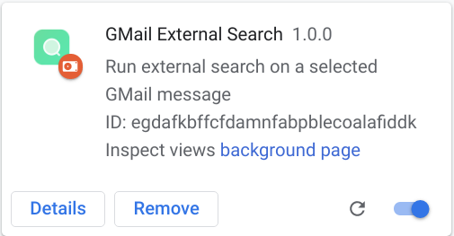
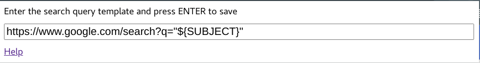

A Chrome extension for running external search queries on the subject of a selected GMail message.
The query results are opened in a new tab.

## Installation

This extension is not published on Chrome Web Store. Follow the instructions in this section to install an unpacked extension in developer mode.

Open the `chrome://extensions` page in your Google Chrome Browser and make sure that the `Developer mode` knob is turned on.


Press the `Load unpacked` button and select the top-level directory of the `gmail-xsearch-chrome` project. If the loading is successful, you should see the extension card appearing in your page.



## Configuration

Press the  button in your browser and select the `GMail External Search` extension from the list.


The configuration dialog displays the default search query template, which uses `google.com` search engine to run the query.



Change the search query according to your needs and press `ENTER` to save settings. Specify the `${SUBJECT}` variable in the query where the email subject text should be substituted. The following example runs the query in Google Groups archives.

```
https://groups.google.com/search/conversations?inOrg=true&q=subject%3A"${SUBJECT}"
```

## Usage

Open an email message in GMail and note the  external search icon in the toolbox area. 
Note that you may need to press the  menu button to see the full list of tools including the external search.

Press the  external search icon to see the query results in a new tab.
